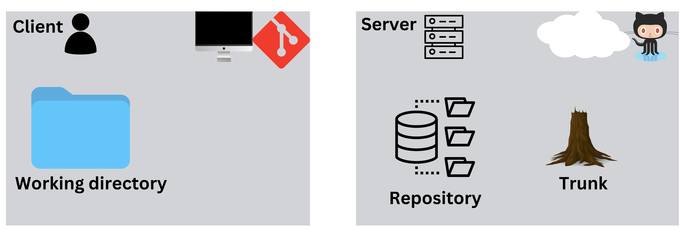
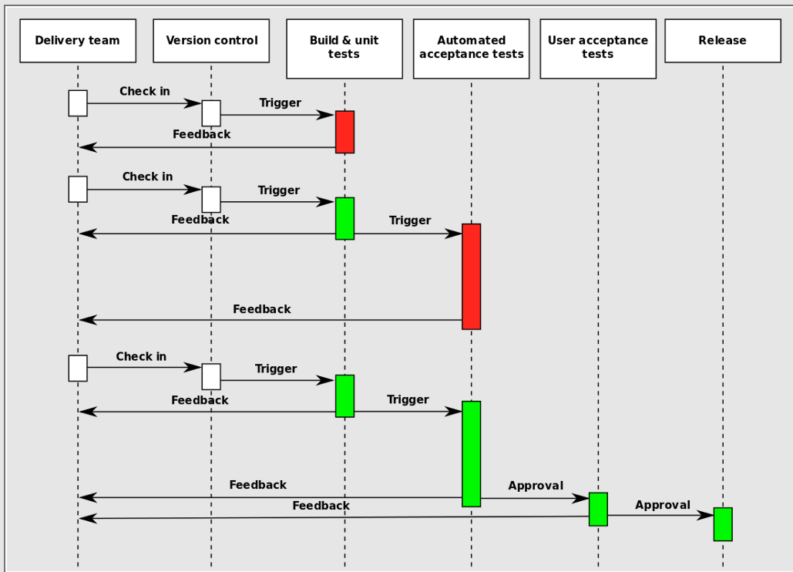
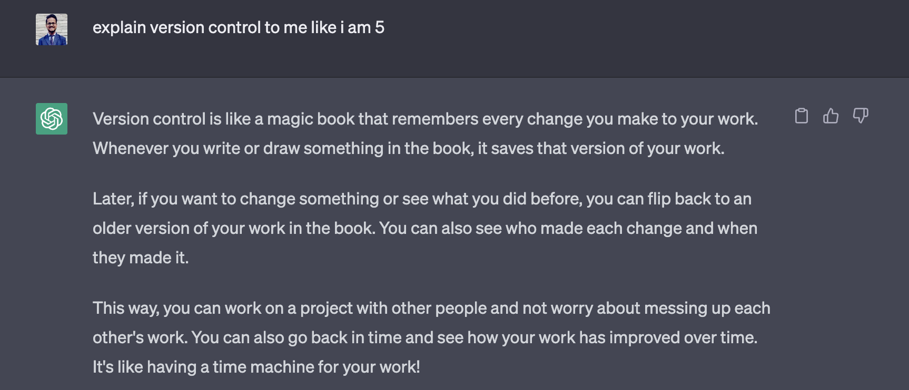
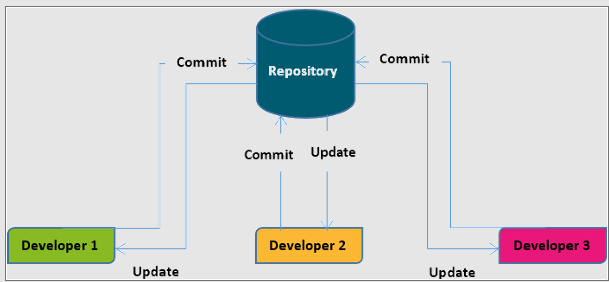
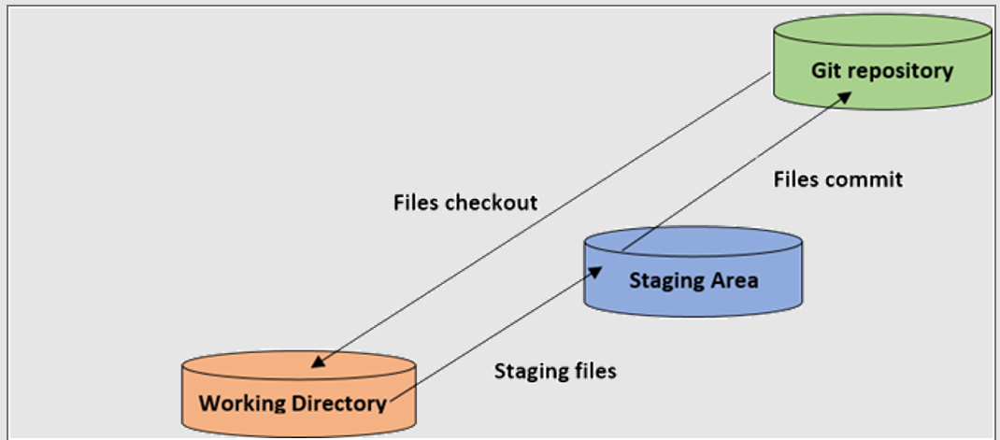
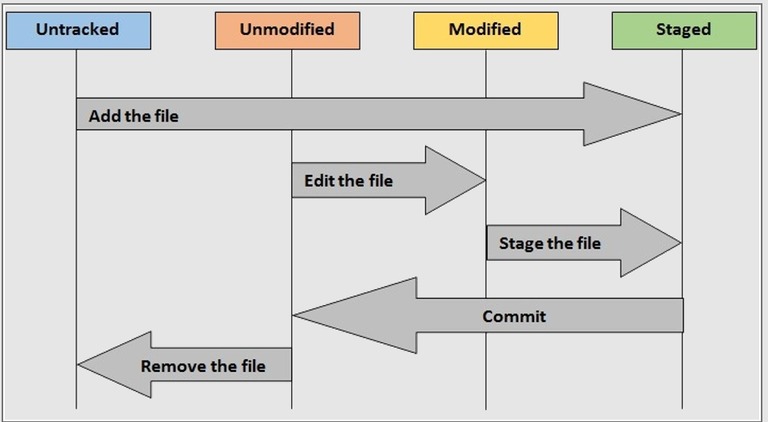

# Introduction to Git and GitHub

**Source Code Management:** Source code management is the process of tracking and managing changes to the software over the software development lifecycle.

### Components of Source Code Management

* Repository

* Server

* Client

* Working Directory
 
* Trunk

### Basic Functionalities of Source Code Management

* Add

* Check Out

* Check In

* Check In message

* Revision

* Head

* Changelog

* Revert

### Features of SCM

* Backup and Restore

* Synchronize

* Earlier version review

* Recent version restore

* Version History

* Owner History

* Testing Environment

* Branching and Merging

### CI/CD

In continuous integration practice, a **centralized server** regularly retrieves all new changes to the source code by developers and builds the **software application from scratch.**

The **build and testing of the software is automated and every change or iteration to the software triggers an automated test run to ensure the desired delivery quality.** The central repository is always kept updated in continuous integration practice.

Continuous deployment is the process of building, testing, and releasing the software from the build environment into the production environment automatically without human intervention. Continuous deployment automates the entire testing process and performs more tests on code blocks compared to the usual unit testing done on the code.

### Version Control System (VCS)

### Git

* Git is a **distributed version control system** used for managing the source code in software development by tracking changes to files and coordinating work among **multiple users**.

* Git is released as **free** software under the terms of the **GNU General Public License** version 2 or later.

* Git perceives the information as a series of **snapshots** of files. Git takes a snapshot of how files look like at the moment when a project is committed or saved and it stores a reference to that snapshot of files.

* As an **efficient version control system**, Git does not store snapshot of files again if nothing has changed in the file and it only stores a link to the previous identical snapshot of the file it has already stored.

#### Coherence and file tracking using Git VCS

* Git version control system assigns a checksum to every file or directory before it is stored and the file or directory is referenced by that **checksum**.

* The checksum is usually a **40-character string which is composed of hexadecimal characters (a-f and 0-9)** and it is calculated depending on the contents of a file or directory in Git.

* **Git uses SHA-1 hash mechanism for checksumming**.

* The SHA-1 (Secure Hash Algorithm 1) is a cryptographic hash algorithm which generates a checksum from a sequence of bytes of any length in a file or a directory.

#### Three main sections of a Git Project

* Working Directory

* Staging Area

* Git Directory

#### Three states of a file in Git Project

* Modified

* Staged

* Committed

#### Features of Git

* Non-Linear Development Support

* Distributed Development

* Compatibility

* Large Projects Handling

* Encryption of History

* Toolkit based Design

* Flexible merges

* Garbage collection

* Periodic Packing of files

### GitHub

GitHub is a cloud based repository hosting service for Git VCS.

## Important Links and References

[Download Git Bash](https://git-scm.com/downloads)

[Read the Official Pro-Git E-book](https://git-scm.com/book/en/v2)

[GitHub Education Pack](https://education.github.com/pack)

[Introduction to Markdown](https://github.com/NishkarshRaj/Markdown-for-Documentation)

[Github Docs](https://docs.github.com/en)