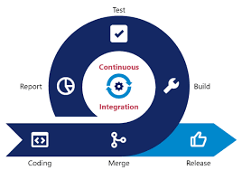
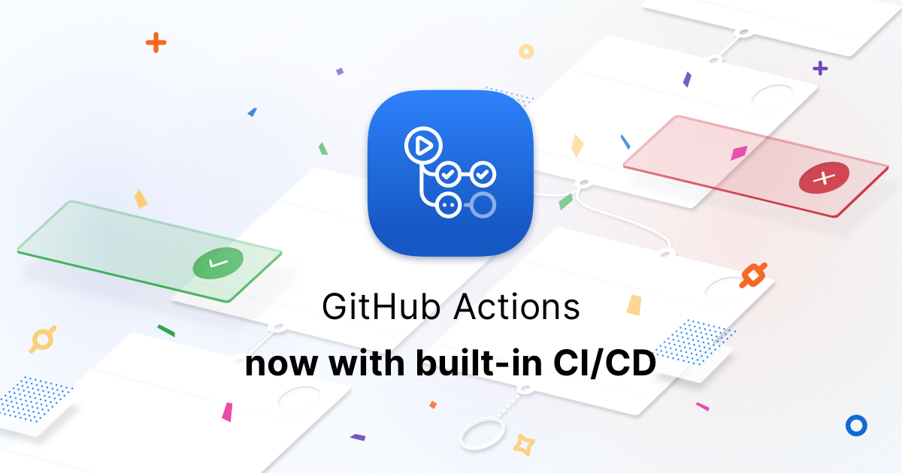

# Introduction to GitHub Actions

### Continuous Integration



In continuous integration practice, a centralized server regularly retrieves all new changes to the source code by developers and builds the software application from scratch.

The build and testing of the software is automated and every change or iteration to the software triggers an automated test run to ensure the desired delivery quality. The central repository is always kept updated in continuous integration practice.

### Continuous Deployment


### GitHub Actions



### A template GitHub Action - Create React App

```yaml
# This workflow will do a clean installation of node dependencies, cache/restore them, build the source code and run tests across different versions of node
# For more information see: https://docs.github.com/en/actions/automating-builds-and-tests/building-and-testing-nodejs

name: Node.js CI

on:
  push:
    branches: [ "main" ]
  pull_request:
    branches: [ "main" ]

jobs:
  build:

    runs-on: ubuntu-latest

    strategy:
      matrix:
        node-version: [14.x, 16.x, 18.x]
        # See supported Node.js release schedule at https://nodejs.org/en/about/releases/

    steps:
    - uses: actions/checkout@v3
    - name: Use Node.js ${{ matrix.node-version }}
      uses: actions/setup-node@v3
      with:
        node-version: ${{ matrix.node-version }}
        cache: 'npm'
    - run: |
        npm install
```

## Important Links and References

[GitHub Actions](https://github.com/features/actions)

[GitHub Actions Help](https://help.github.com/en/actions)

[Learn Docker](https://iq.opengenus.org/basics-of-using-docker/)

[GitHub Actions Blog](https://iq.opengenus.org/github-actions-using-container-scripts/)

[Actions Checkout Repository](https://github.com/actions/checkout)

[GitHub Marketplace](https://github.com/marketplace)


